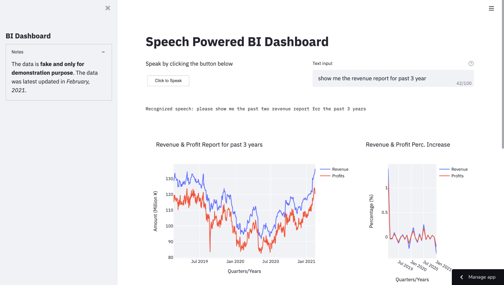

# Deloitte Competition Finalist Project Demo

Speech recognition application that transforms natural language orders (in both Chinese and English) into visualized interfaces. 

* Demo video [link](https://drive.google.com/file/d/1zDA6gcEUT7V5F9_qN4k3h8GCqpRL0YdP/view?usp=sharing). 

* Preliminary pitch deck [link](https://docs.google.com/presentation/d/1uuumPO_dkBrCPFkgZ3M-nm9bKmEIWgAXfAKW-hqkC6I/edit?usp=sharing). 

* Web application [link]().

