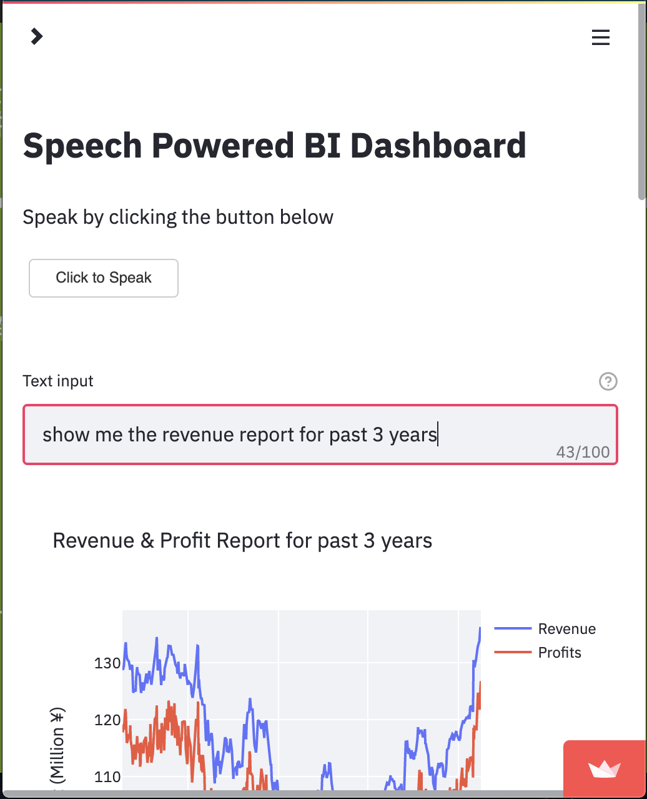

# Deloitte Competition Finalist Project

Speech recognition application that transforms natural language orders (in both Chinese and English) into visualized interfaces. 

Demo video [link](https://drive.google.com/file/d/1zDA6gcEUT7V5F9_qN4k3h8GCqpRL0YdP/view?usp=sharing).

